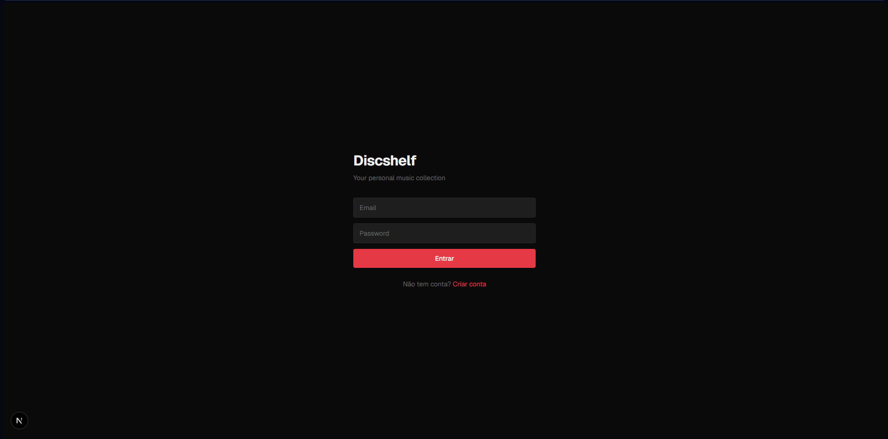
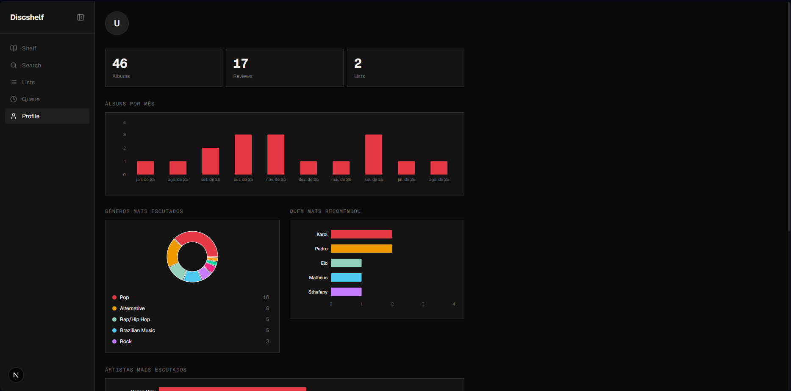

# Discshelf

Discshelf é uma estante digital de álbuns. Catalogue o que você ouve, escreva reviews, monte listas de álbuns / artistas / faixas, mantenha uma fila de escuta e acompanhe suas estatísticas.

---

## Sumário

- [Primeiros passos](#primeiros-passos)
- [Shelf (sua prateleira)](#shelf-sua-prateleira)
- [Buscar álbuns](#buscar-álbuns)
- [Reviews](#reviews)
- [Listas](#listas)
- [Queue (fila de escuta)](#queue-fila-de-escuta)
- [Perfil e estatísticas](#perfil-e-estatísticas)
- [Rodar o projeto](#rodar-o-projeto)

---

## Primeiros passos

### Criar conta

Na tela de cadastro, informe nome, e-mail e senha.

### Entrar

Depois é só logar com e-mail e senha. Sua sessão fica salva no navegador.

---

## Shelf (sua prateleira)

A **Shelf** é sua coleção de álbuns. Cada capa é um álbum catalogado.

Para adicionar, clique em **Add Album**, busque e adicione à prateleira.

### Organizar a Shelf

- **Ordenar**: use o menu de ordenação (por adição, título, artista, ano ou **Minha ordem**).
- **Minha ordem**: começa do mais novo → mais antigo. Álbuns adicionados entram no topo.
- **Arrastar**: segure e arraste qualquer capa para reordenar. Ao arrastar, a ordenação vira automaticamente **Minha ordem** e é salva.
- **Remover**: passe o mouse sobre a capa e clique no ícone de lixeira.

> Dica: dá para **esconder a barra lateral** pelo botão no topo dela, ganhando mais espaço para a prateleira. Um botão flutuante reabre a barra.

---

## Buscar álbuns

Na aba **Search**, digite o nome do álbum ou artista. Os resultados vêm do Spotify (com gênero via Deezer).

De cada resultado você pode **adicionar à Shelf** (`+ Shelf`) ou **à Queue** (ícone de relógio).

---

## Reviews

Clique em um álbum da Shelf para abrir o **pop-up de review**. Registre:

- Texto da review
- Mês em que ouviu
- Quem recomendou
- Faixas favoritas

Álbuns com review recebem um selo de check na capa.

---

## Listas

Além da Shelf, você cria **listas** de três tipos: **álbuns**, **artistas** ou **faixas**.

### Criar lista

Em **Lists → New List**, escolha o tipo e dê um nome.

### Dentro de uma lista

Abra a lista para adicionar itens (a busca respeita o tipo da lista), **arrastar para reordenar**, renomear (clique no título) ou remover itens.

---

## Queue (fila de escuta)

A **Queue** guarda álbuns que você ainda quer ouvir. Ao adicionar pela busca, você pode informar **quem recomendou**.

- **Quem recomendou**: passe o mouse sobre o álbum (desktop) para ver quem indicou. No mobile aparece direto abaixo do álbum.
- **Add to Shelf**: move o álbum da fila para a prateleira.
- **Sortear**: com 2+ álbuns, use o botão **Sortear** para o app escolher um aleatório para você ouvir.

---

## Perfil e estatísticas

A aba **Profile** reúne dados da conta e gráficos da sua coleção.

### Álbuns por mês

Quantos álbuns você registrou em cada mês (com base no mês informado nas reviews).

### Gêneros mais escutados e quem mais recomendou

No gráfico de pizza de **gêneros**, clique em uma fatia (ou na legenda) para abrir um pop-up com os **álbuns daquele gênero** na sua Shelf.

### Artistas mais escutados

### Editar conta

Ainda no Profile, você atualiza nome, e-mail e senha, ou deleta a conta.

